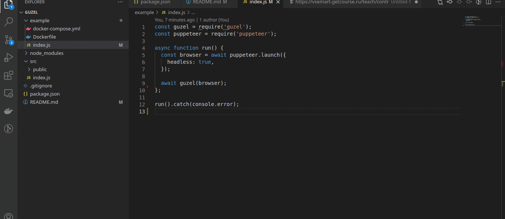

# Puppeteer Remote Controller

If you want to **connect to headless puppeteer**, you don't need to change your code at all. Just add the following lines for **puppeteer-remote-controller** activation!

```javascript
const prc = require('puppeteer-remote-controller');

// const browser = await puppeteer.launch...

prc(browser);
```

Then open `http://localhost:3208` to control your puppeteer browser.

## Demo



## Instalation

```
npm i -S puppeteer-remote-controller
```

## Usage

```javascript
const prc = require('puppeteer-remote-controller');

//...

const browser = await puppeteer.launch({ headless: true, args: ['--no-sandbox'] });

await prc(browser);

//...
```

## Remote browser (headless puppeteer remote usage)

You can run **puppeteer-remote-controller** on remote server (ex. `your-server.com`)

```ssh
ssh your-server.com
git clone git@github.com:ivanoff/puppeteer-remote-controller.git
cd guzel/example
sudo docker-compose up
```

Then open `your-server.com:3208` and start to surf the internet with your **puppeteer remote controller**
